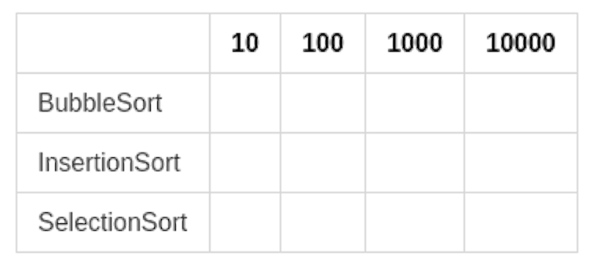

% Tópico 2: Ordenação -- Noções Básicas e Algoritmos Clássicos
% Prof. Dr. Juliano Henrique Foleis

Estude com atenção os vídeos e as leituras sugeridas abaixo. Os exercícios servem para ajudar na fixação do conteúdo e foram escolhidos para complementar o material básico apresentado nos vídeos e nas leituras. Quando o exercício pede que crie ou modifique algum algoritmo, sugiro que implemente-o em linguagem C para ver funcionando na prática. 

# Vídeos

<!-- Noções Básicas, Seleção, Bolha e Inserção  -->

[Ordenação Por Seleção (Selection Sort)](https://youtu.be/H7rPPCXNfCs)

[Ordenação Pelo Método da Bolha (Bubble Sort)](https://youtu.be/N5RlJItpPzE)

[Ordenação por Inserção (Insertion Sort)](https://youtu.be/efiCoqRQxb4)

# Leitura Sugerida

PEREIRA, Silvio Lago. Estruturas de Dados em C - Uma Abordagem Didática. [Minha Biblioteca].
Capítulo 8 (Ordenação e Busca), Seções 8.1 e 8.2.1, 8.2.2 e 8.2.3 [Link](https://integrada.minhabiblioteca.com.br/#/books/9788536517254/pageid/82)

FEOFILOFF, Paulo. Projeto de Algoritmos em C. Ordenação: Algoritmos Elementares [Link](https://www.ime.usp.br/~pf/algoritmos/aulas/ordena.html)

SZWARCFITER, Jayme Luiz e MARKENZON, Lilian. Estruturas de Dados e Seus Algoritmos. [Minha Biblioteca].
Capítulo 7 (Algoritmos de Ordenação), Seções 7.1, 7.2, 7.3 - [Link](https://integrada.minhabiblioteca.com.br/#/books/978-85-216-2995-5/epubcfi/6/34[;vnd.vst.idref=chapter07]!/4/356@0:0])

VETORAZZO, Adriana Souza; SARAIVA, Maurício Oliveira; BARRETO, Jeanine Santos; JUNIOR, Ram. Estrutura de dados. [Minha Biblioteca]. Páginas 29-42 (Ordenação de Dados - Métodos Simples) [Link](https://integrada.minhabiblioteca.com.br/#/books/9788595023932/pageid/28)

# Exercícios

## Exercícios dos materiais de leitura sugerida

Exercícios 8.1 - 8.5 do livro do Pereira: [Link](https://integrada.minhabiblioteca.com.br/#/books/9788536517254/pageid/92)

Exercícios 7.1, 7.2 e 7.11 do livro de Szwarcfiter e Markenzon [Link](https://integrada.minhabiblioteca.com.br/#/books/978-85-216-2995-5/epubcfi/6/34[;vnd.vst.idref=chapter07]!/4/282/66@0:88.9)

Exercícios 1.1, 2.2, 2.3, 3.2, 3.3, 4.3, 5.2, 5.3 da página do Prof. Feofiloff [Link](https://www.ime.usp.br/~pf/algoritmos/aulas/ordena.html)

## Exercícios Complementares

<!--ordenação por seleção escolhendo os menores
ordenação por seleção recursivamente
implementar a função troca
implementar a função max
-->

**1)** Implemente a função *max* usada no algoritmo de ordenação por seleção apresentado no vídeo 1.

**2)** Implemente a função *troca* usada nos algoritmos de ordenação por seleção e bolha apresentados nos vídeos 1 e 2.

**3)** Reescreva o algoritmo de ordenação por seleção apresentado no Vídeo 1 de tal forma que ordene o vetor escolhendo os menores elementos ao invés dos maiores. 

**4)** O algoritmo abaixo é uma modificação do algoritmo de ordenação pelo método da bolha. A idéia é que detecte a situação que nenhuma troca ocorreu durante uma varredura, o que indica que o vetor já está ordenado. Neste caso não é necessário realizar mais varreduras no vetor, pois já encontra-se ordenado. Modifique e implemente o algoritmo a seguir para que a verificação de trocas inicie da forma mais tardia possível (ou seja, de forma que nem sempre *j* comece em 0). 

~~~{.c .numberLines}
int bubble_sort(int* V, int n){
    int trocas;
    int j;
    trocas = 1;
    while(trocas){
        trocas = 0;
        for(j = 0; j < n-1; j++;){
            if(V[j] > V[j+1]){
                trocas++;
                troca(V, j, j+1);
            }
        }
    }
}
~~~

**5)** Altere os algoritmos de ordenação por seleção, bolha, e inserção apresentados nos vídeos 1, 2 e 3 de forma que os vetores resultantes estejam ordenados em ordem decrescente.

**6)** Considere que a entrada para o algoritmo de ordenação por inserção apresentado no vídeo 3 seja um vetor *v* de tamanho *n* tal que todos os elementos são iguais. Quantas vezes o laço *while* vai executar? Explique seu raciocínio.

**7)** Considere que a entrada para o algoritmo de ordenação por inserção apresentado no vídeo 3 seja um vetor *v* de tamanho *n* tal que os elementos estejam ordenados em ordem decrescente. Quantas vezes o laço *while* vai executar? Explique seu raciocínio.

<!-- # Atividade Para Entregar

A atividade a seguir é para ser feita individualmente e entregue via Moodle no tópico da Semana 1. A data-limite para entrega é dia 8/3/2021 às 23:55. Em caso de cópia as atividades dos participantes serão desconsideradas.

## Descrição da Atividade -->

**8)** Uma forma de avaliar o desempenho de algoritmos de ordenação consiste em contar quantas comparações são realizadas durante a execução. Nesta atividade você vai comparar a quantidade de comparações realizadas pelos três algoritmos estudados em função do tamanho do vetor.

**a)** Para que a comparação seja justa, os vetores utilizados devem ter os mesmos elementos. Para isso, implemente a função *int\* random_vector(int n, int max, int seed)* que retorna um vetor de inteiros de tamanho *n* alocado dinâmicamente e preenchido com valores aleatórios de 0 a *max* gerados a partir da semente *seed*. Você pode usar a função [*rand()*](http://cplusplus.com/reference/cstdlib/rand/) da *stdlib.h* para gerar um número aleatório e [*srand()*](http://cplusplus.com/reference/cstdlib/srand/) para alterar a semente do gerador de números aleatórios. Dessa forma a chamada *random_vetor(100, 1000, 0)* sempre gerará um vetor aleatório de números de 0 a 1000 com 100 posições sempre na mesma sequencia.

**b)** Altere os algoritmos apresentados nos vídeos 1, 2 e 3 para retornarem a quantidade de comparações diretas entre 2 elementos do vetor. A posição que o contador é incrementado varia de acordo com o algoritmo. No algoritmo SelectionSort, as comparações diretas acontecem na função *max*. No algoritmo BubbleSort devemos contar quantas vezes a comparação *if(v[i] > v[i+1])* é executada (não somente quantas vezes é verdadeira). Ja no algoritmo InsertionSort devemos contar quantas vezes o conteúdo do laço *while* é repetido. Note que, no caso das rotinas SelectionSort e InsertionSort estamos interessados na soma total dass comparações efetuadas pelas funções auxiliares *insertion* e *max*.

**c)** Gere vetores aleatórios com 10, 100, 1000 e 10000 usando sua função *random_vector* com *seed = 0*. Execute os 3 algoritmos alterados no item *b* em cada um dos vetores gerados. Anote o número, em notação científica com 3 casas decimais, o número de comparações realizadas na tabela a seguir:

\centering

\justify

Anote também, em segundos, o tempo que cada algoritmo demorou para executar. Utilize a função [*clock()*](http://cplusplus.com/reference/ctime/clock/). Anote suas medidas em uma tabela.

\noindent
**d)** Responda:

\noindent
**i)** Algum algoritmo executou consideravelmente menos comparações considerando vetores com mais que 10 elementos?

\noindent
**ii)** O algoritmo que executou menos comparações foi o que precisou de menos tempo para executar a ordenação?

\noindent
**iii)** O que tem de interessante nos dois algoritmos com maior numero de comparações em relação ao tempo de execução? Explique o resultado.

<!-- ## Você deve Entregar

Entregue em formato .zip os arquivos a seguir:

* Um arquivo *pdf* com as tabelas do item *c* e as respostas do item *d*;
* Um arquivo .c com a implementação dos algoritmos propostos nos itens *a* e *b* e o programa principal utilizado para gerar os resultados no item *c*.

**Por favor entregue como especificado acima!** -->

\vspace{50pt}

\Large
\centering
**BONS ESTUDOS!**
