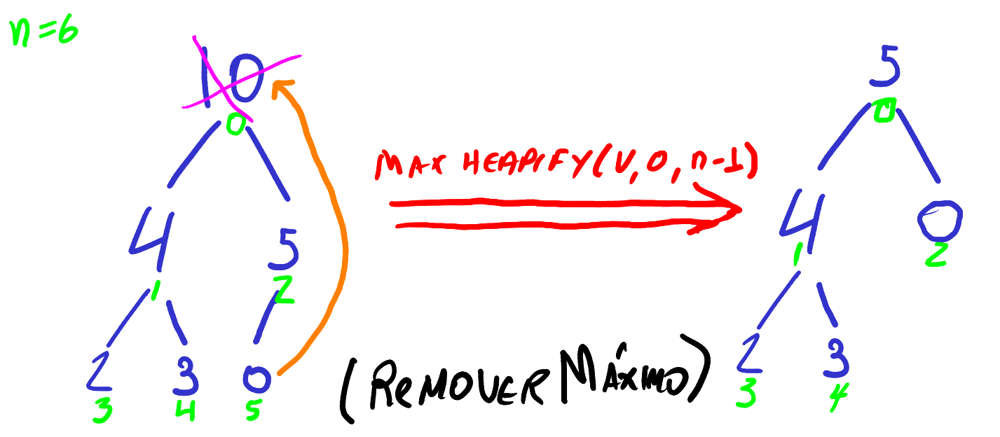
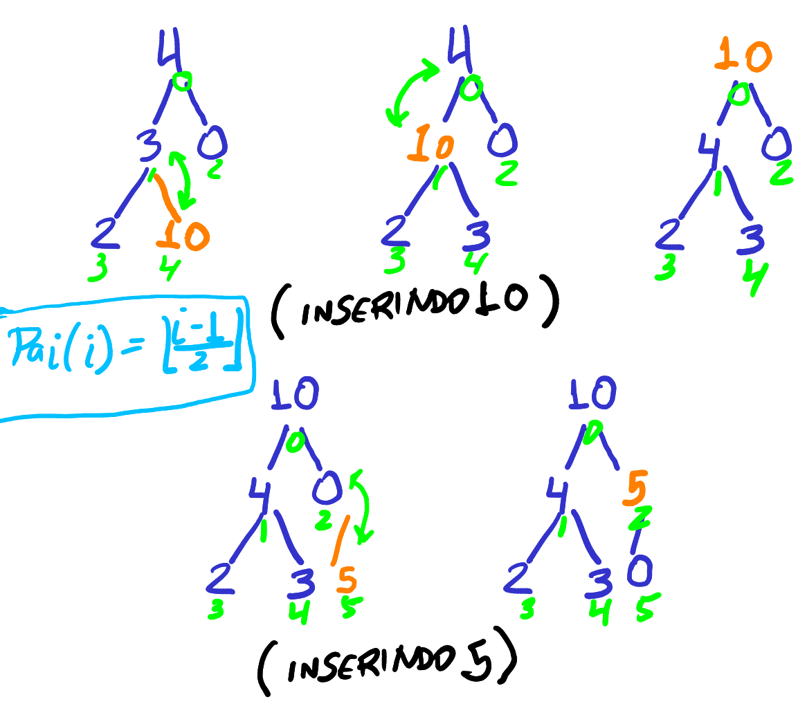

% Tópico 3: Ordenação Eficiente -- Parte 2: Heap Sort
% Prof. Dr. Juliano Henrique Foleis

Estude com atenção os vídeos e as leituras sugeridas abaixo. Os exercícios servem para ajudar na fixação do conteúdo e foram escolhidos para complementar o material básico apresentado nos vídeos e nas leituras. Quando o exercício pede que crie ou modifique algum algoritmo, sugiro que implemente-o em linguagem C para ver funcionando na prática. 
<!-- O único exercício que é necessário entregar está descrito na Seção "Atividade Para Entregar". -->

# Vídeos

[Heap Sort (Ordenação Por Heap) - Parte 1: Árvores Heap e MaxHeapify](https://youtu.be/x5erNI7li_s)

[Heap Sort (Ordenação Por Heap) - Parte 2: Construção da Max Heap](https://youtu.be/KwiyNWQoMy0)

[Heap Sort (Ordenação Por Heap) - Parte 3: Ordenação por Heap](https://youtu.be/64d8U7rNjQM)

# Leitura Sugerida

FEOFILOFF, Paulo. Projeto de Algoritmos em C. Heapsort [(Link)](https://www.ime.usp.br/~pf/algoritmos/aulas/hpsrt.html)

# Exercícios

## Exercícios dos materiais de leitura sugerida

Exercícios 1.1, 2.1, 2.2, 2.3, 2.5, 2.6, 3.1, 4.7, 5.1, 5.2, 5.3, 5.6 da página do Prof. Feofiloff (Heapsort) [(Link)](https://www.ime.usp.br/~pf/algoritmos/aulas/hpsrt.html)

Exercícios 7.6, 7.7, 7.8 do livro de Szwarcfiter e Markenzon [(Link)](https://integrada.minhabiblioteca.com.br/#/books/978-85-216-2995-5/epubcfi/6/34[;vnd.vst.idref=chapter07]!/4/282/66@0:88.9)

## Exercícios Complementares

**1.** A função *int MaxK(int \*V, int n, int k)* recebe um vetor *V* (considere-o desornenado) de tamanho *n*, e um inteiro *k*. Esta função deve retornar o k-ésimo maior valor distindo do vetor *V*. O vetor pode ter repetições. Por exemplo, para *k=2* e *V = [0,0,4,5]*, MaxK retorna 4. Caso o vetor não possua *k* elementos distintos, retorne o maior valor de todos. Utilize uma heap máxima para implementar MaxK.

**2.** Execute o HeapSort em um vetor aleatório gerado com a função *int\* random_vector(int n, int max, int seed)* com *n = 1000, 10000, 100000, 500000*, *max = n \* 100* e *seed = 0*. Repita os experimentos com os mesmos valores para *n*, dessa vez com um vetor já ordenado. Compare com os resultados obtidos na atividade da Semana 2.

<!-- # Atividade Para Entregar

Não há atividade para entregar.

A atividade a seguir é para ser feita individualmente e entregue via Moodle no tópico da Semana 3. A data-limite para entrega é dia 24/3/2021 às 23:55. Em caso de cópia as atividades dos participantes serão desconsideradas. -->

<!-- ## Descrição da Atividade -->

<!-- Nesta semana você vai implementar filas de prioridades utilizando árvores heap. Além disso, você vai usar a fila de prioridades para resolver um problema. -->

**3)** Neste exercício você vai implementar filas de prioridades utilizando árvores heap. Além disso, você vai usar a fila de prioridades para resolver um problema.

Uma fila de prioridades é semelhante a uma fila, de forma que um elemento sempre é inserido no final e removido do início da fila. A diferença é a que a ordem lógica dos elementos na fila não depende apenas da ordem de chegada, mas também da prioridade dos elementos. Desta forma, os elementos de maior prioridade ficam no início da fila, enquanto os elementos de menor prioridade vão para o final da fila. Portanto é possível que um elemento recém-adicionado ao final da fila pode ser colocado diretamente no início da fila por conta de sua maior prioridade. 

Filas de prioridades podem priorizar os maiores valores ou menores valores. Por exemplo, em uma fila que prioriza os maiores valores, quando os elementos com prioridades 4, 2, 0, 3, 10, 5 são inseridos em uma fila de prioridades, eles vão ser retirados na sequência 10, 5, 4, 3, 2, 0. **Note que a estrutura não necessariamente precisa guardar os elementos na sequencia que vão ser retirados, mas sim devem devolver os elementos na ordem que respeita a prioridade.**

As três principais operações de uma fila de prioridades são: Início (*int FP_inicio(int\* fp, int n)*), Remover Máximo (*int FP_remover_maximo(int\* fp, int n)*) e Inserir (*int FP_inserir(int\* fp, int n, int x)*). Filas de prioridades são comumente implementadas usando árvores heap. A razão é que heaps representam prioridade de forma natural e as operações podem ser implementadas eficientemente.

A operação Início, por exemplo, deve retornar o elemento com a maior prioridade da fila. Conforme estudamos, em uma heap máxima o maior elemento encontra-se sempre na primeira posição da heap! Portanto, ao usar uma heap para gerenciar a fila de prioridade, o maior elemento, que tem maior prioridade, está sempre na primeira posição do vetor. 

No caso da operação Remover Máximo, podemos simplesmente trocar o elemento da ultima posição da heap e executar *max_heapify* na raíz, como fizemos para "subir" o próximo maior no algoritmo Heap Sort. A Figura 1 apresenta um exemplo da operação Remover Máximo, usando uma heap para armazenar uma fila de prioridades.

Assim como a inserção em uma fila comum, a operação Inserir de uma fila de prioridades inicialmente coloca o novo elemento no final da fila. Entretanto, é necessário ajustar a fila para que o elemento seja posicionado na posição adequada conforme sua prioridade. Neste caso, o elemento é comparado com seu pai, e caso o novo elemento seja maior, eles trocam de posição, arrumando a propriedade de heap máximo. A verificação continua até que o elemento se torne a raíz da árvore ou um pai com maior prioridade seja encontrado. A Figura 2 apresenta dois exemplos não-triviais da operação Inserir.

**a)** Implemente uma fila de prioridades utilizando uma heap máxima. 

**i.** *int FP_inicio(int\* fp, int n)*: dada uma fila de prioridades *fp* e o número de elementos *n*, retorne o valor do elemento que está no início da fila;

**ii.** *int FP_remover_maximo(int\* fp, int n)*: dada uma fila de prioridades *fp* e o número de elementos *n*, remova o elemento mãximo da fila, arrume a estrutura e retorne o novo tamanho da fila.

**iii.** *int FP_inserir(int\* fp, int n, int x)*: dada uma fila de prioridades *fp*, o número de elementos *n* e o elemento a ser inserido *x*, insira *x* na fila, mantendo a propriedade de heap máximo na estrutura toda. Retorne o novo tamanho da fila.

**b)** Reimplemente a fila de prioridades do exercício **a**, mas desta vez a prioridade deve ser dos valores menores. Chamamos a heap correspondente de heap mínimo, cuja propriedade heap é que o valor do pai deve ser menor ou igual a ambos filhos.

**c)** Use a fila de prioridades implementada no exercício anterior para resolver o problema a seguir.

Seu time favorito de futebol, o Curintia, está na final do campeonato brasileiro (sim, faz tempo isso, antes de ser ponto corrido). Você decide acompanhar seu time na final e vai ao estádio. Quando você chega no estádio pra comprar o ingresso você vê ***N*** pessoas na fila da bilheteria. Existem ***M*** fileiras no estádio, com capacidades diferentes. O preço do ingresso depende da fileira e da quantidade disponível de assentos restantes. Se a fileira tem ***K*** assentos disponíveis, então o preço da entrada é *R\$ 100 + (100 / k)*. A fila de ingressos é única, então um ingresso é vendido por vez.

Dados os números de assentos disponíveis em cada fileira e o número de pessoas na fila, encontre o maior lucro possível que pode ser obtido com a venda de ingressos.

### Entrada

A entrada do programa é um arquivo de 2 linhas no seguinte formato:

A primeira linha consiste em 2 inteiros, ***M*** e ***N***. ***M*** é o número de fileiras do estádio e ***N*** é o número de pessoas na fila da bilheteria.

A segunda linha consiste em ***M*** inteiros separados por espaços, ($X[1] X[2] \dots X[i] \dots X[M]$) onde o $X[i]$ corresponde ao número de assentos disponíveis na i-ésima fileira.

### Saída

A saída é um único número em ponto flutuante, indicando o maior lucro possível com a venda dos ingressos aos ***N*** torcedores da fila. A saída deve ser impressa no terminal e deve ser arredondada para duas casas decimais.

### Restrições

$1 \leq M \leq 1000$

$1 \leq N \leq 1000$

$1 \leq X[i] \leq 1000$

A soma de $X[i]$ para $1 \leq i \leq M$ é sempre maior que ***N***.

### Exemplo

**Exemplo do arquivo de entrada:**

~~~
3 4
1 2 5
~~~

**Exemplo de saída:**

~~~
670
~~~

**Explicação do Exemplo**

No exemplo acima, o número de fileiras é 3 e 4 torcedores estão esperando na fila. Como queremos o maior lucro possível, isso ocorre quando vendemos primeiro os ingressos das fileiras com menos assentos disponíveis. Assim, para o primeiro torcedor vendemos o único ingresso da fileira 1, por 200 reais. Para o segundo torcedor vendemos um ingresso (de 2 disponíveis) da fileira 2 por 150. O terceiro torcedor fica com o ultimo ingresso da fileira 2 por 200. Por fim, o quarto torcedor fica com um ingresso (de 5 disponíveis) da fileira 3. Portanto, o lucro obtido com a venda desses 4 ingressos é $200 + 150 + 200 + 120 = 670$.

**d.** Execute os casos e preencha a tabela a seguir:

\begin{table}[h]
\centering
\begin{tabular}{|c|l|l|}
\hline
\textbf{Caso} & \multicolumn{1}{c|}{\textbf{Tempo de Execução}} & \multicolumn{1}{c|}{\textbf{Lucro obtido}} \\ \hline
\textbf{1} &  &  \\ \hline
\textbf{2} &  &  \\ \hline
\textbf{3} &  &  \\ \hline
\textbf{4} &  &  \\ \hline
\textbf{5} &  &  \\ \hline
\textbf{6} &  &  \\ \hline
\textbf{7} &  &  \\ \hline
\end{tabular}
\caption{Resultados}
\label{tab:my-table}
\end{table}

<!-- ## Você deve Entregar

Entregue em formato .zip os arquivos a seguir:

* Um arquivo *.c* com a implementação de ambas filas de prioridade dos itens **a** e **b**;
* Um arquivo *.c* com o programa que resolve o problema do item **c**.
* Um arquivo *saidas.pdf* com a tabela do item **d** preenchida.

**Por favor entregue como especificado acima!**  -->

\vspace{70pt}

\Large
\centering
**BONS ESTUDOS!**
