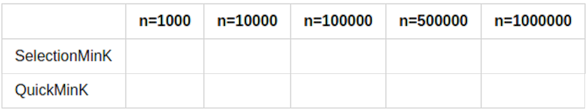

% Tópico 4: Busca em Vetor -- Busca Sequencial e Busca Binária
% Prof. Dr. Juliano Henrique Foleis

Estude com atenção os vídeos e as leituras sugeridas abaixo. Os exercícios servem para ajudar na fixação do conteúdo e foram escolhidos para complementar o material básico apresentado nos vídeos e nas leituras. Quando o exercício pede que crie ou modifique algum algoritmo, sugiro que implemente-o em linguagem C para ver funcionando na prática. O único exercício que é necessário entregar está descrito na Seção "Atividade Para Entregar".

# Vídeos

[Busca Sequencial](https://youtu.be/OsA-v9v3Fz0)

[Busca Binária](https://youtu.be/30x2zYESY1Y)

# Leitura Sugerida

PEREIRA, Silvio Lago. Estruturas de Dados em C - Uma Abordagem Didática. [Minha Biblioteca].
Capítulo 8 (Ordenação e Busca), Seção 8.3 [(Link)](https://integrada.minhabiblioteca.com.br/#/books/9788536517254/pageid/91)

FEOFILOFF, Paulo. Projeto de Algoritmos em C. Busca em vetor ordenado [(Link)](https://www.ime.usp.br/~pf/algoritmos/aulas/bubi.html)

# Exercícios

## Exercícios dos materiais de leitura sugerida

Exercício 8.6 do livro do Pereira: [Link](https://integrada.minhabiblioteca.com.br/#/books/9788536517254/pageid/92)

Exercícios 2.5, 5.1, 5.2, 5.3, 7.3, 8.2, 9.1, 9.4, 9.5, 9.6, 9.7 da página do Prof. Feofiloff (Busca em vetor ordenado): [(Link)](https://www.ime.usp.br/~pf/algoritmos/aulas/bubi.html)

## Exercícios Complementares

**1.** Há ocasiões que queremos encontrar todos os elementos que possuem uma determinada chave *x*. Para isso, podemos alterar a função de busca sequencial para iniciar a partir de uma posição *p*. Esta função pode ter o protótipo *busca\_sequencial(int \*v, int n, int x, int p)*. Para encontrar todos os elementos com a chave k, podemos usar a seguinte estrutura de repetição:

~~~{.c}
int pos = -1;
do{
    pos = busca_sequencial(v, n, k, pos+1);
    f(v, n, pos); // fazer alguma coisa com o elemento encontrado.
}while(pos != -1);
~~~

Implemente a função *busca\_sequencial(int \*v, int n, int x, int p)*.

**2.** Repita a funcionalidade da função *busca\_sequencial(int \*v, int n, int x, int p)* do exercício anterior, mas usando a busca binária para encontrar todas os elementos com a chave *x*. Desta vez, considere que o vetor *v* é um vetor já ordenado. DICA: Use o fato do vetor estar ordenado para usar a busca binária apenas uma única vez, quando *p == 0*. Para os demais valores de *p*, retorne *p* quando o elemento *v[p]* for *x*, e *-1* quando for diferente.

**3.** Reescreva o algoritmo de busca binária de forma iterativa.

**4.** Use a busca binária em um vetor ordenado *v* com *n* elementos para encontrar os seguintes elementos:

**a.** O a posição do elemento sucessor aos elementos com chave *x* (*sucessor(int \*v, int n, int x)*). O sucessor é o elemento que tem a próxima chave maior que *x*. Considere que a chave *x* pode não estar no vetor.

**b.** O a posição do elemento antecessor aos elementos com chave *x* (*antecessor(int \*v, int n, int x)*). O antecessor é o elemento que tem a próxima chave maior que *x*. Considere que a chave *x* pode não estar no vetor.

**c.** A posição do vizinho mais próximo do elemento com a chave *x* (*vizinho_mais_proximo(int \*v, int n, int x)*). O vizinho mais próximo é o antecessor ou o sucessor, dependendo de quem é o mais próximo.

<!-- # Atividade para Entregar

A atividade a seguir é para ser feita individualmente e entregue via Moodle no tópico da Semana 4. A data-limite para entrega é dia 30/07/2021 às 23:55. Em caso de cópia as atividades dos participantes serão desconsideradas.

## Descrição da Atividade -->

**5.** O algoritmo de busca binária é muito eficiente para buscar por chaves em vetores ordenados. Além disto, se todos os elementos forem únicos (sem repetições de chaves) podemos encontrar a *k*-ésima menor chave de um vetor em tempo constante ($O(1)$) acessando a posição $k-1$ do vetor diretamente.

Entretanto, nem sempre é viável manter um vetor ordenado quando ele é alterado com frequência durante a execução. Isso porque as operações de inserção e remoção que mantém o vetor ordenado tem custo linear. Isso impede que a busca em vetor seja feita de forma eficiente (busca binária) e que a *k*-ésima menor chave do vetor seja encontrada em tempo constante.

Nesta atividade vamos implementar a operação MinK, que encontra a k-ésima menor chave de um vetor usando três abordagens diferentes. Todas as abordagens sugeridas não requerem que o vetor seja ordenado por completo. Apesar de não executarem em tempo constante, elas são alternativas interessantes, principalmente quando *k* não é um valor relativamente pequeno.

**a.** A função *int SelectionMinK(int \*v, int n, int k)* recebe um vetor *v* (considere-o desordenado e sem repetições) de tamanho *n* e um inteiro *k* $\in [1 \dots n]$. Esta função deve retornar a *k*-ésima menor chave do vetor *V*. Por exemplo, para *k=3* e *V = [0,1,4,5]*, SelectionMinK retorna 4 (o 3o maior elemento do vetor). Altere o SelectionSort ([vídeo curto](https://youtu.be/H7rPPCXNfCs)) para que encontre sucessivamente a próxima menor chave, até que chegue na k-ésima menor. Caso o vetor possua menos de k elementos, retorne o menor elemento do vetor. Durante a busca os elementos podem ser permutados.

**b.** O algoritmo QuickSort pode ser modificado para implementar a busca pela *k*-ésima menor chave de um vetor. Seja *int QuickMinK(int \*v, int e, int d, int k)* a função que implementa esse algoritmo, tal que *v* é um vetor possívelmente desordenado e sem repetições de tamanho *n*, *e* e *d* tem o mesmo significado que em QuickSort e o inteiro *k* $\in [1 \dots n]$. *Partition* sempre retorna a posição do pivô, que não sai mais do lugar. Em outras palavras, o pivô possui a *k*-ésima menor chave de um vetor no caso que todas as chaves de *v* são distintas. Use essa propriedade para alterar o QuickSort e obter o algoritmo QuickMinK. Caso o vetor possua menos de k elementos, retorne o maior elemento do vetor. Durante a busca os elementos podem ser permutados.

**c.** Implemente uma função *int \* random_vector_unique_elems(int n, int seed)*. Um jeito legal de fazer isso é gerar um vetor com *n* elementos em ordem crescente e daí usar um algoritmo de embaralhamento, como o abaixo (caso estiver usando windows use a função random_32bits ):

~~~{.c}
#include <stdlib.h>
void embaralhar(int *v, int ini, int fim){
    int i, j;

    for(i = fim-1; i > ini; i--){
        j = (rand() % (i + 1));
        j = j <= ini? ini+1 : j;
        trocar(v, i, j);
    }

}
//substituir a chamada rand() acima por random_32bits() se estiver usando Windows.
unsigned int random_32bits(){
    unsigned int x;
   
    x = rand() & 0xff;
    x |= (rand() & 0xff) << 8;
    x |= (rand() & 0xff) << 16;
    x |= (rand() & 0xff) << 24;

    return x;
}
~~~

**d.** Execute os dois algoritmos sugeridos acima para buscar a *k*-ésima menor chave de um vetor aleatório gerado com a função *int\* random_vector_unique_elems(int n, int seed)* com *n = 1000, 10000, 100000, 500000* e *seed = 42*. Preencha as tabelas a seguir com o tempo de execução dos seguintes casos de testes (**só precisa executar o *SelectionMinK* até p/ k=10000**):

**e.** Você notou algum padrão nos resultados obtidos no item **d**? Explique o que você descobriu.

<!-- ## Você deve Entregar

Entregue em formato .zip os arquivos a seguir:

* Os arquivos-fonte desenvolvidos nos itens **1--4**. Faça um *Makefile* para compilar o seu programa. Modularize conforme julgar necessário.
* As Tabela preenchida no item **4** e a resposta da pergunta do item **5** em um *pdf*. Sua resposta do item **5** deve ter pelo menos 3 linhas.

\centering

**Por favor entregue como especificado acima!**  

\vspace{50pt}

**A data-limite para entrega é dia 9/11/2021 às 23:55.** -->

\vspace{50pt}
\centering
\Large

**BONS ESTUDOS!**
