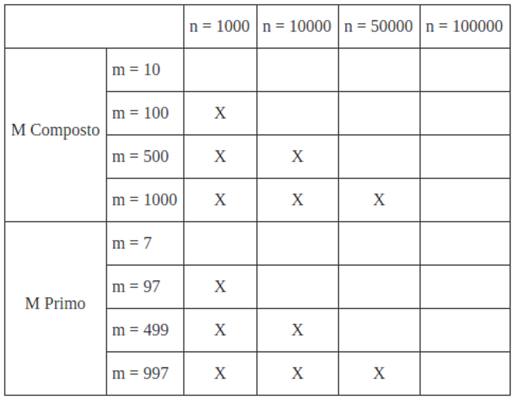

% Tópico 5: Conceitos básicos sobre *Hashing* e Tratamento de Colisões por Encadeamento Direto
% Prof. Dr. Juliano Henrique Foleis

Estude com atenção os vídeos e as leituras sugeridas abaixo. Os exercícios servem para ajudar na fixação do conteúdo e foram escolhidos para complementar o material básico apresentado nos vídeos e nas leituras. Quando o exercício pede que crie ou modifique algum algoritmo, sugiro que implemente-o em linguagem C para ver funcionando na prática. O único exercício que é necessário entregar está descrito na Seção "Atividade Para Entregar".

# Vídeos

[Conceitos Básicos sobre Hashing](https://youtu.be/osy1xBefHsU)

[Tratamento de Colisões por Encadeamento Direto](https://youtu.be/a-w2rwCEwx0)

# Leitura Sugerida

FEOFILOFF, Paulo. Estruturas de Dados. *Hashing* - **Seções:** Idéias Preliminares, Funções de Hashing, Função de Hashing Modular, O que se espera de uma função de hashing ideal, Implementação 1: hashing com encadeamento. [(Link)](https://www.ime.usp.br/~pf/estruturas-de-dados/aulas/st-hash.html)

# Exercícios

## Exercícios dos materiais de leitura sugerida

Exercícios 1.1, 1.2, 2.1, 3.4, 4.1, 4.2, 4.6, 4.7 da página do Prof. Feofiloff (Hashing): [(Link)](https://www.ime.usp.br/~pf/estruturas-de-dados/aulas/st-hash.html)

## Exercícios Complementares

**1.** ***Hashing de Strings*** -- Uma função de hashing popularmente utilizada em strings baseia-se em converter a representação em ASCII da string em um inteiro em uma base K qualquer, seguido por módulo M. Por exemplo, a string "ABC" (65, 66, 67) pode ser representada na base K=31 por: $65 \times 31^2 + 66 \times 31^1 + 67 \times 31^0 = 65 \times 961 + 66 \times 31 + 67 \times 1 = 64578$. Com M=37, $H(\text{ABC}; 37) = 64578 \, \% \, 37 = 13$. Lembrando que $K$ e $M$ são parâmetros e podem ser escolhidos de acordo com a aplicação.

**a.** Implemente a função de hashing sugerida acima. Use o protótipo: *unsigned int string_hash(char\* string, int M)*. Considere que a string é terminada em '\\0' (*null-terminated*).

**b.** Uma forma eficiente de implementar a função de hashing sugerida acima é utilizando o Método de Horner. Um exemplo do método:

$$2x^3 + 3x^2 + 4x + 5 = ((2x + 3)x + 4)x + 5$$

Implemente a função *unsigned int string_hash(char\* string, int M)* usando o Método de Horner.

**c.** Seja $n$ o comprimento da string. Encontre duas funções (matemáticas) $f_a(n)$ e $f_b(n)$ que calcule o número de somas e multiplicações realizadas pelos métodos implementados nos exercícios **a** e **b**. Compare os $f_a(n)$ e $f_b(n)$ para $n = 5, 10, 20, 100$.

**2.** Clone (ou atualize!) o repositório da disciplina no [github](https://github.com/julianofoleiss/BCC33A). A implementação da tabela hashing com encadeamento direto está nos arquivos `hashing/hashtable_ed.c` e `hashing/hashtable_ed.h`.

**a.** Implemente as funções em branco conforme mostrado no [vídeo](https://youtu.be/a-w2rwCEwx0).

**b.** Implemente as funções a seguir no arquivo `hashing/ed/hashtable_ed.c`. Estas funções retornam as **chaves** mínima e máxima que estão armazenadas na tabela hash. Não esqueça de acrescentar os protótipos em `hashing/ed/hashtable_ed.h`!

    i. int min(HTED* HT);
    ii. int max(HTED* HT);

**c.** Modifique a estrutura da tabela hash em `hashing/ed/hashtable_ed.h` para que as funções *min* e *max* sejam executadas em O(1), ou seja, de forma que não seja necessário varrer toda a estrutura para encontrar os respectivos valores. Modifique todas as funções que sejam necessárias.

**DICA:** Basta atualizar variáveis na estrutura que indicam o valor mínimo ou máximo quando houver alguma mudança na estrutura, seja essa inserção, remoção ou atualização.

**d.** Implemente a função `static void THED_Redimensionar(THED* HT, size_t c, size_t reserva)` que redimensiona a tabela `HT` para que, sob hipótese de hashing uniforme, as buscas sejam realizadas em no máximo `c` tentativas. Reserve pelo menos `reserva` posições a mais do que necessário. Caso não haja necessidade de realizar o redimensionamento, a função deve simplesmente terminar sem alterar a tabela.

**DICA:** Lembre-se que a quantidade máxima de tentativas esperada sob a hipótese de hashing uniforme é `N/M` onde `N` é o número de elementos com chaves distintas na tabela e `M` é o tamanho da tabela. 

**DICA 2:** Note que esta função está marcada como `static`, ou seja, ela não estará disponível para outros módulos. Desta forma, seu protótipo não deve estar em `hashing/ed/hashtable_ed.h`.

**e.** Altere a função `THED* THED_Criar(int m, int alloc_step)` para que tenha um novo protótipo `THED* THED_Criar(int m, int alloc_step, size_t c)` tal que o parâmetro `c` indica o número máximo de tentativas desejadas para realizar as buscas sob a hipótese de hashing uniforme. Altere a estrutura `THED` para também armazenar `c`. Não esqueça de atualizar o protótipo em `hashing/ed/hashtable_ed.h`.

**f.** Altere a função `void THED_Inserir(THED* HT, int chave, int valor)` para que a função `THED_Redimensionar` implementada no exercício **d** seja invocada.

**DICA:** Note que como a função `THED_Redimensionar` não altera a tabela se não for necessário redimensionar, não é necessário verificar se o redimensionamento é necessário para invocar `THED_Redimensionar`.

**DICA 2:** Lembre-se que todos os parâmetros necessários para invocar `THED_Redimensionar` estão armazenados no parâmetro `HT`.

<!-- # Atividade para Entregar

A atividade a seguir é para ser feita individualmente e entregue via Moodle no tópico da Semana 5. A data-limite para entrega é dia 15/11/2021 às 23:55. Em caso de cópia as atividades dos participantes serão desconsideradas.

## Descrição da Atividade -->

**3.** Nesta atividade vamos avaliar a diferença entre usar números primos e números compostos como M na função de hashing modular. Esta avaliação é apenas um teste empírico bem simples, então não é possível tirar conclusões muito abrangentes. No entanto, é um bom exercício para ter uma idéia de uma situação prática.

**ATENÇÃO:** Nesta atividade utilize a implementação que não contempla o redimensionamento automático!

**a.** Faça uma função *THED\* inserir_n_aleatorios(int n, int m, int seed)* que crie uma tabela hash com encadeamento direto com *m* posições e insira *n* elementos aleatórios com a semente *seed*. Os números aleatórios devem estar no intervalo $[0 \dots 10n]$. Sua função deve retornar a tabela preenchida. A implementação *ilist* não permite chaves repetidas na lista, portanto não se preocupe com esse caso.

**b.** Implemente as funções a seguir que retornam o comprimento da lista mais curta, o comprimento da lista mais longa e o comprimento médio das listas em uma tabela hash *TH*:

    i. int THED_MaisLonga(THED* TH);
    ii. int THED_MaisCurta(THED* TH);
    iii. float THED_TamMedio(THED* TH);

**c.** Preencha as Tabelas 1, 2 e 3 a seguir usando as funções implementadas nos itens **a** e **b**. Use *seed = 42*.

**d.** Preencha a Tabela 4 com o valor teórico do comprimento das listas (N/M) em um caso de hashing uniforme.

**e.** Nos casos avaliados houve alguma diferença significativa no comprimentos das listas mais longas e mais curtas entre M primo e M composto? Se sim, em qual(is) caso(s)?

**f.** Nos casos avaliados houve alguma diferença significativa no comprimento médio das listas entre M primo e M composto? Se sim, em qual(is) caso(s)?

**g.** O comprimento médio das listas (Tabela 3) é comparável ao comprimento esperado diante da hipótese de hashing uniforme (Tabela 4)? O que isso quer dizer?

<!-- ## Você deve Entregar

Entregue em formato .zip os arquivos a seguir:

* Os arquivos-fonte desenvolvidos nos itens **a--b**, bem como os arquivos-fonte criados para realizar os testes. Faça um *Makefile* para compilar o seu programa. Modularize conforme julgar necessário.
* As Tabelas preenchidas nos itens **c** e **d** e as respostas das perguntas dos itens **e--g** em um *pdf*.

\centering

\vspace{20pt}

**Por favor entregue como especificado acima!**  

\vspace{50pt}

**A data-limite para entrega é dia 15/11/2021 às 23:55.** -->

\vspace{50pt}

\Large

**BONS ESTUDOS!**
