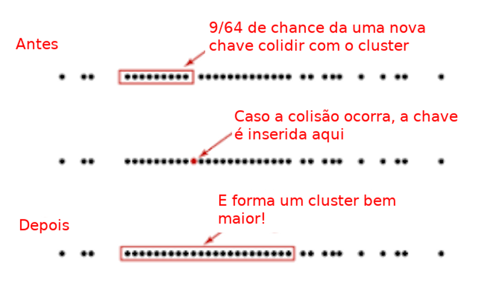
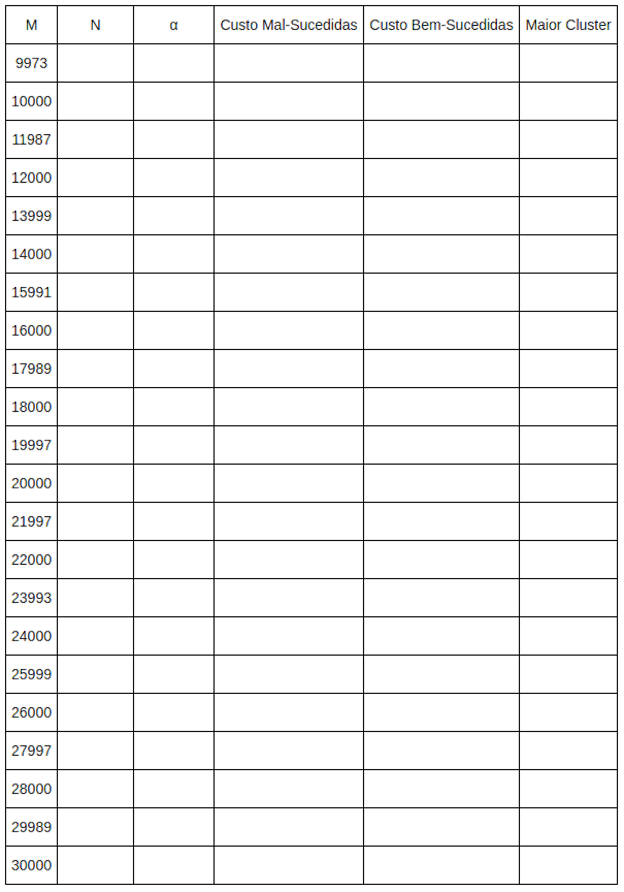

% Tópico 6: *Hashing* (Parte 1) - Tratamento de Colisões por Endereçamento Aberto com Sondagem Linear
% Prof. Dr. Juliano Henrique Foleis

Estude com atenção os vídeos e as leituras sugeridas abaixo. Os exercícios servem para ajudar na fixação do conteúdo e foram escolhidos para complementar o material básico apresentado nos vídeos e nas leituras. Quando o exercício pede que crie ou modifique algum algoritmo, sugiro que implemente-o em linguagem C para ver funcionando na prática. O único exercício que é necessário entregar está descrito na Seção "Atividade Para Entregar".

# Vídeos

[Tratamento de Colisões por Endereçamento Aberto com Sondagem Linear](https://youtu.be/A39mY5k64qg)

# Errata do Vídeo

No vídeo eu afirmo que o algoritmo de *inserção* apresentado garante que não haverão chaves repetidas na estrutura. Enretanto, isto não é verdade em todos os casos. Considere o seguinte contra-exemplo: vamos supor que estamos inserindo a chave `x=43` após apagar a chave `x=44` e que a chave `x=44` está na posição de colisão `C` com a chave `x=43`. Também considere que a chave `x=43` já estava ocupando o posição `C+1`. Como o estado da posição `C` é `APAGADO` o algoritmo simplesmente insere `x=43` na posição `C`, mesmo que `x=43` já esteja ocupando a posição `C+1`, uma vez que a posição `C` é avaliada antes da posição `C+1`.

Para resolver este problema podemos fazer uma busca na tabela para verificar se a chave `x` já está na tabela. Caso esteja, apenas o valor é modificado. Isto pode ser feito de forma eficiente uma vez que a busca retorna a posição na tabela que `x` ocupa. Caso `x` não esteja na tabela, basta inserir o elemento conforme o algoritmo apresentado no vídeo. Considerando que o tempo da busca e da inserção apresentada no vídeo são constantes, o custo do algoritmo de inserção proposto aqui permanece constante. Para referência, o algoritmo correto de inserção (em C) é este:

\pagebreak

```{.c .numberLines}
int THEA_Inserir(THEA *TH, int chave, int valor){
    int h, k, h_inicial;
    h = THEA_Buscar(TH, chave);
    if(h < 0) // a chave ainda não está na tabela
    {
        k = 0;
        h = THEA_Hash(TH, chave, k);
        h_inicial = h;
        while(TH->TH[h].estado == E_OCUPADO){

            if(TH->TH[h].chave == chave){
                break;
            }
            k++;
            h = THEA_Hash(TH, chave, k);
            if(h == h_inicial)
                return -1;
        }
    }
    TH->TH[h].chave = chave;
    TH->TH[h].valor = valor;
    TH->TH[h].estado = E_OCUPADO;
    return h;
}
```

# Leitura Sugerida

FEOFILOFF, Paulo. Estruturas de Dados. *Hashing* - **Seções:** Implementação 2: hashing com sondagem linear [(Link)](https://www.ime.usp.br/~pf/estruturas-de-dados/aulas/st-hash.html)

# Exercícios

## Exercícios dos materiais de leitura sugerida

Exercícios 5.1, 5.2, 5.3 da página do Prof. Feofiloff (Hashing): [(Link)](https://www.ime.usp.br/~pf/estruturas-de-dados/aulas/st-hash.html)

## Exercícios Complementares

**1.** Clone (ou atualize!) o repositório da disciplina no [github](https://github.com/julianofoleiss/BCC33A). A implementação da tabela hash com endereçamento aberto está nos arquivos *hashing/hashtable_ea.c* e *hashing/hashtable_ea.h*.

**a.** Implemente as funções em branco conforme mostrado no [vídeo](https://youtu.be/A39mY5k64qg).

**b.** Implemente as funções a seguir no arquivo *hashing/hashtable_ea.c*. Estas funções retornam as **chaves** mínima e máxima que estão armazenadas na tabela hash. Não esqueça de acrescentar os protótipos em *hashing/hashtable_ea.h*!

    i. int min(THEA* TH);
    ii. int max(THEA* TH);

**c.** Modifique a estrutura da tabela hash em *hashing/hashtable_ea.h* para que as funções *min* e *max* sejam executadas em O(1), ou seja, de forma que não seja necessário varrer toda a estrutura para encontrar os respectivos valores. Modifique todas as funções que sejam necessárias.

**DICA:** Basta atualizar variáveis na estrutura que indicam o valor mínimo ou máximo quando houver alguma mudança na estrutura, seja essa inserção, remoção ou atualização.

<!-- # Atividade para Entregar

A atividade a seguir é para ser feita individualmente e entregue via Moodle no tópico da Semana 6. A data-limite para entrega é dia 30/11/2021 às 23:55. Em caso de cópia as atividades dos participantes serão desconsideradas.

## Descrição da Atividade -->

**2.** Um dos problemas com o tratamento de colisões por endereçamento aberto é o aparecimento de *clusters* na tabela. *Clusters* (pelotas, grumos, agrupamentos contíguos) são caracterizados por subvetores longos ocupados na tabela. Isso faz com que dificilmente o acesso aos elementos necessite de apenas algumas poucas verificações. A Figura a seguir mostra um exemplo a formação de *clusters*:



**a.** Projete e implemente as funções *THEA_ClusterMaximo*, *THEA_TamMedioClusters* que retornem o tamanho do maior cluster e o tamanho médio de todos os clusters presentes na tabela, respectivamente. Considere  também *clusters* de tamanho 1. Use os protótipos a seguir:

    i. int THEA_ClusterMaximo(THEA* TH);
    ii. float THEA_TamMedioClusters(THEA* TH);

Quando a busca por uma chave é mal-sucedida (a chave não está na tabela), é necessário percorrer todo o *cluster* e atingir o final. Desta forma, o tamanho médio dos clusters (implementado na função *THEA_TamMedioClusters*) pode ser interpretado como o custo médio de uma busca mal-sucedida por uma chave. 

**b.** O fator de carga, dado por $\alpha = N / M$, tal que *N* é a quantidade de posições ocupadas na tabela e *M* é o total de posições na tabela indica quão cheia a tabela se encontra. Inclua um campo *N* na estrutura *THEA* para contabilizar a quantidade de posições ocupadas na tabela. Modifique as funções *THEA\_Inserir* e *THEA\_Remover* para atualizar *N* de forma adequada. Em especial durante a inserção, não incremente N se detectar que a chave está repetida!

**c.** Quando a busca por uma chave é bem-sucedida (a chave está na tabela), na média é necessário percorrer metade do *cluster* que a chave se encontra. Portanto é possível estimar o custo médio de uma busca bem-sucedida por uma chave com a função abaixo:

$$\frac{1}{N}\sum_{i=0}^C \max \left (\frac{T[i]}{2},1 \right)$$

tal que $T$ é um vetor que contém o tamanho de todos os *clusters* e $C$ é o número de *clusters*. Implemente essa função com o protótipo *THEA_CustoBemSucedida(THEA \*TH)*. (max é a função máximo, que retorna o maior número entre os argumentos).

**d.** Preencha a tabela abaixo usando as funções que você implementou. Para cada M, crie uma tabela hash com endereçamento aberto com sondagem linear e insira as chaves geradas aleatoriamente com a função *int\* random_vector(int n, int max, int seed)* Use *n = 10000*, *max = 10n* e *seed = 42*.



**e.** Com base nos dados da tabela, responda as questões a seguir.

**i.** Existe alguma relação entre o valor de $\alpha$ e o custo das buscas? Se sim, qual é?

**ii.** Existe alguma diferença entre o custo das buscas quando comparamos entre M primo e M composto? Caso exista, essa diferença se mantém para todos os valores de $\alpha$?

**iii.** Suponha que depois da inserção de muitas chaves no início do seu programa você vai fazer muito mais consultas na sua tabela do que inserções de novas chaves. Você se preocuparia mais em escolher M para diminuir o custo de buscas bem-sucedidas ou mal-sucedidas? 

**iv.** $\alpha$ é comumente utilizado como limiar para o redimensionamento da tabela conforme mais elementos são inseridos. Qual um limiar que você acha adequado para os casos que você não conhece N de antemão? Por quê? (Estudaremos como implementar o redimensionamento na próxima semana.)

<!-- ## Você deve Entregar

Entregue em formato .zip os arquivos a seguir:

* Os arquivos-fonte desenvolvidos nos itens **a--d**, bem como os arquivos-fonte criados para realizar os testes. Faça um *Makefile* para compilar o seu programa. Modularize conforme julgar necessário.
* A Tabela preenchida no item **d** e as respostas das perguntas do item **e** em um *pdf*. -->

\centering

<!-- \vspace{20pt}

**Por favor entregue como especificado acima!**  

\vspace{50pt}

**A data-limite para entrega é dia 30/11/2021 às 23:55.** -->

\vspace{50pt}

\Large

**BONS ESTUDOS!**
