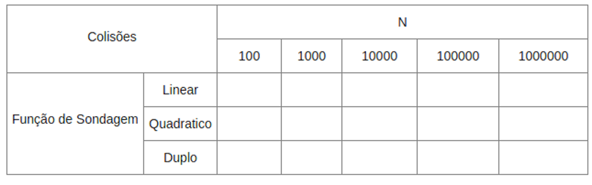

% Tópico 7: *Hashing* - Redimensionamento de Tabelas Hash e Funções de Sondagem
% Prof. Dr. Juliano Henrique Foleis

Estude com atenção os vídeos e as leituras sugeridas abaixo. Os exercícios servem para ajudar na fixação do conteúdo e foram escolhidos para complementar o material básico apresentado nos vídeos e nas leituras. Quando o exercício pede que crie ou modifique algum algoritmo, sugiro que implemente-o em linguagem C para ver funcionando na prática. 
<!-- O único exercício que é necessário entregar está descrito na Seção "Atividade Para Entregar". -->

# Vídeos

[Redimensionamento de Tabelas Hash com Endereçamento Aberto  (Rehashing)](https://youtu.be/9CjAfMZVNNU)

[Funções de Sondagem (Sondagem Quadrática e Sondagem por Hash Duplo)](https://youtu.be/JxIvhAObpXI)

# Leitura Sugerida

FEOFILOFF, Paulo. Estruturas de Dados. *Hashing* - **Seção:** Redimensionamento da tabela de sondagem linear [(Link)](https://www.ime.usp.br/~pf/estruturas-de-dados/aulas/st-hash.html)

# Exercícios

**1.** Clone (ou atualize!) o repositório da disciplina no [github](https://github.com/julianofoleiss/BCC33A). A implementação da tabela hash com endereçamento aberto está nos arquivos `hashing/ea/hashtable_ea.c` e `hashing/ea/hashtable_ea.h`.

**a.** Implemente as funções em branco conforme mostrado no [vídeo](https://youtu.be/A39mY5k64qg). (Já foi um exercício do tópico passado.)

**b.** Implemente a função *static void THEA\_Redimensionar(THEA\* TH, int m_novo)* e as alterações nas funções THEA_Criar, THEA_Inserir e THEA_Remover, conforme apresentado no [vídeo](https://youtu.be/9CjAfMZVNNU).

**c.** Altere a função THEA\_Redimensionar para que faça o a diminuição da tabela (caso *m_novo < TH->m*) somente se for possível, ou seja, se *TH->n <= m\_novo*.

**d.** Conforme discutido no [vídeo](https://youtu.be/9CjAfMZVNNU), caso muitas remoções sejam realizadas na tabela, o fator de carga pode diminuir de tal maneira que haja desperdício excessivo de espaço. Para evitar o desperdício, insira uma verificação na função *THEA\_Remover*, que invoque *THEA\_Redimensionar* assim que $\alpha$ < 0.2. Redimensione a tabela para possuir apenas a metade das posições que antes do redimensionamento. 

**OBS:** Nem sempre esse redimensionamento para economizar espaço é recomendado, uma vez que a operação de redimensionamento pode prejudicar o desempenho do programa caso ela seja realizada com muita frequência.

**2.** No [vídeo](https://youtu.be/9CjAfMZVNNU) apresentei o redimensionamento da tabela hash que usa tratamento de colisões por endereçamento aberto. Tabelas hash que utilizam tratamento de colisões por encadeamento também podem ser redimensionadas utilizando um algoritmo de redimensionamento semelhante. A idéia criar um novo vetor de listas encadeadas de forma que $M$ seja o próximo primo após $2M$ e inserir todos os elementos que estavam na tabela original na nova tabela.

Um detalhe importante é que agora $\alpha$ necessariamente é maior que 1, uma vez que as colisões são tratadas usando uma lista encadeada para cada posição da tabela hash. Sabemos que sob a hipótese de hashing uniforme o tamanho médio das listas é aproximadamente $\alpha$. Logo, caso queiramos que sejam feitas em média $k$ varreduras até encontrar a chave, podemos realizar o redimensionamento quando $\alpha > k$.

**i.** Altere as funções *THED\_Criar*, *THED\_Inserir* e *THED\_Remover* e a estrutura *THED* (em `hashing/ed/hashtable_ed.h` e `hashing/ed/hashtable_ed.c`) para contabilizar a quantidade de elementos (n) na tabela hash.

**ii.** Implemente a função *static void THED\_Redimensionar(THED\* TH, int m_novo)* em `hashing/ed/hashtable_ed.h` conforme descrito acima. **DICA:** Use a função THEA\_Redimensionar(THEA\* TH, int m_novo)* em `hashing/ea/hashtable_ea.c` como referência.

**iii.** Altere a função *THED\_Criar* para receber e gravar o parâmetro *k* na estrutura THED. O parâmetro *k* foi explicado no enunciado.

**iv.** Altere a função *THED\_Inserir* para verificar a condição necessária para o redimensionamento, conforme explicado no enunciado. Caso seja, chame a função *THED\_Redimensionar* para realizar a operação.

<!-- # Atividade para Entregar

Não há atividade para entregar.

A atividade a seguir é para ser feita individualmente e entregue via Moodle no tópico da Semana 8. A data-limite para entrega é dia 4/5/2021 às 23:55. Em caso de cópia as atividades dos participantes serão desconsideradas. -->

<!-- 
## Descrição da Atividade -->

**3.** Nesta atividade vamos avaliar o número de colisões usando as três funções de sondagem estudadas. Vamos usar a implementação de tabela hash por endereçamento aberto que está no [github](https://github.com/julianofoleiss/BCC33A).

**a.** Implemente a função *static void THEA\_Redimensionar(THEA\* TH, int m_novo)* e as alterações nas funções THEA_Criar, THEA_Inserir e THEA_Remover, conforme apresentado no [vídeo](https://youtu.be/9CjAfMZVNNU).

**b.** A condição utilizada para redimensionar a tabela durante a inserção é:

~~~{.c}
    if(TH->n > TH->m / 2){
        THEA_Redimensionar(TH, TH->m*2);
    }
~~~

Note que o redimensionamento é feito quando $\alpha$ > 0.5. Conforme foi discutido no [vídeo sobre sondagem quadrática](https://youtu.be/JxIvhAObpXI), só há garantia que a inserção vai ser bem-sucedida com $h(x,k) = (x \mod M) + k^2$ se $M$ for primo e se $\alpha$ < 0.5. Altere a condição acima em *THEA_Inserir* para que garantir que a inserção com sondagem quadrática será bem-sucedida.

**c.** Para que as funções de sondagem funcionem conforme expliquei no [vídeo](https://youtu.be/JxIvhAObpXI), vamos garantir que M seja sempre um número primo.

No repositório da disciplina no [github](https://github.com/julianofoleiss/BCC33A) a pasta *hashing* contém um TAD chamado *prime\_list* (*hashing/prime\_list.c* e *hashing/prime\_list.h*). Este TAD implementa uma lista de números primos e permite fazer a consulta pelo próximo número primo após um determinado *n*. A lista de primos é carregada a partir de um arquivo. O repositório também contém um arquivo (*primes1.dat*) com os primeiros 1000000 números primos (2 a 15485863). Estude esse TAD e suas estruturas.

**i.** Ao criar a tabela hash, em *THEA\_Criar*, carregue a lista de primos usando a função *PL\_Load*. Salve o endereço da lista de primos na estrutura THEA, criando um campo adequado na estrutura. Inicialize m para ser o próximo primo a partir de m (mesmo que m já seja primo).

**ii.** Na função *THEA\_Redimensionar*, atualize o valor de m_novo para o número primo que o suceda, usando a função *PL_NextPrime*. Caso m_novo seja maior que 15485863 (o maior número primo em *primes1.dat*), não altere m_novo.

**d.** Uma das formas de comparar o desempenho de funções de sondagem é comparando a quantidade de colisões que ocorreram durante a inserção de uma mesma sequência de chaves. Vamos atualizar nossa estrutura THEA para contabilizar o número total de colisões ocorridas.

**i.** Insira um campo "colisoes" na estrutura THEA. Inicialize colisões com 0 na função *THEA\_Criar*.

**ii.** As colisões durante uma inserção são detectadas no laço while mostrado abaixo. Para contabilizar as colisões ocorridas, basta incrementar o campo "colisoes" da estrutura em todas as repetições desse while. 

~~~{.c}
    while(TH->TH[h].estado == E_OCUPADO){
        //...
    }
~~~

**e.** Crie um mecanismo que permita você escolher qual função de sondagem utilizar passando um parâmetro para a função *HTEA\_Criar*. **DICA:** Altere a estrutura THEA para salvar qual função de sondagem foi escolhida. Conforme a função escolhida, altere o comportamento da função *THEA\_Hash*. Não é necessário alterar as outras funções!

**f.** Preencha a tabela abaixo usando as funções que você implementou. A tabela mostra a quantidade de colisões que aconteceram com cada função de sondagem. Para cada *N*, crie uma tabela hash com tamanho inicial M = 5 e insira as chaves geras aleatoriamente com a função *int\* random_vector(int n, int max, int seed)*. Use *max = 10n* e *seed = 42*. 

**g.** Analisando os resultados obtidos no item **f**:

**i.** Alguma função de sondagem resultou em consistentemente menos colisões para todos os *N* analisados? Se sim, qual?

**ii.** Como que os números de colisões se comparam com os N correspondentes? O que isso quer dizer para o custo da busca? O que aconteceria se permitissemos que $\alpha$ ficasse maior antes de redimensionar a tabela?

**iii.** Quais outros padrões você identificou? Explique.

<!-- \pagebreak

## Você deve Entregar

Entregue em formato .zip os arquivos a seguir:

* Os arquivos-fonte desenvolvidos nos itens **1--6**, bem como os arquivos-fonte criados para realizar os testes. Faça um *Makefile* para compilar o seu programa. Modularize conforme julgar necessário.
* A Tabela preenchida no item **6** e as respostas das perguntas do item **7** em um *pdf*.

\centering

\vspace{20pt}

**Por favor entregue como especificado acima!**   -->

<!-- \vspace{50pt}

**A data-limite para entrega é dia 4/5/2021 às 23:55.** -->

\vspace{50pt}

\centering

\Large

**BONS ESTUDOS!**
