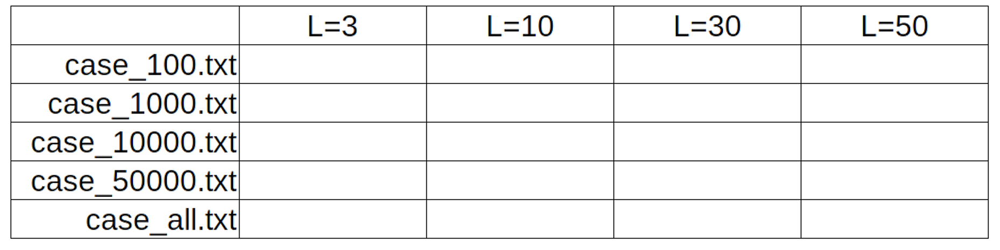

% Tópico 11: *Tries* - Árvores de Prefixos
% Prof. Dr. Juliano Henrique Foleis

Estude com atenção os vídeos e as leituras sugeridas abaixo. Os exercícios servem para ajudar na fixação do conteúdo e foram escolhidos para complementar o material básico apresentado nos vídeos e nas leituras. Quando o exercício pede que crie ou modifique algum algoritmo, sugiro que implemente-o em linguagem C para ver funcionando na prática. O único exercício que é necessário entregar está descrito na Seção "Atividade Para Entregar".

# Vídeos

[Tries: Árvores de Prefixos](https://youtu.be/Spmw4hTo7ek)

# Leitura Sugerida

FEOFILOFF, Paulo. Estruturas de Dados. *Tries (árvores digitais)* [(Link)](https://www.ime.usp.br/~pf/estruturas-de-dados/aulas/tries.html)

## Exercícios dos materiais de leitura sugerida

Exercícios 3.1, 3.2 da página do Prof. Feofiloff (Tries (árvores digitais)): [(Link)](https://www.ime.usp.br/~pf/estruturas-de-dados/aulas/tries.html)

# Atividade para Entregar

A atividade a seguir é para ser feita individualmente e entregue via Moodle no tópico da Semana 10. A data-limite para entrega é dia 16/10/2020 às 23:55. Em caso de cópia as atividades dos participantes serão desconsideradas.

## Descrição da Atividade

Clone (ou atualize!) o repositório da disciplina no [github](https://github.com/julianofoleiss/BCC33A). A implementação da trie está nos arquivos *trie/asciitrie.c* e *trie/asciitrie.h*.

**1.** Implemente as funções a seguir:

**a.** Implemente as funções *AT_Criar*, *AT_Buscar*, *AT_Inserir* e *AT_Remover* conforme mostrado no [vídeo](https://youtu.be/Spmw4hTo7ek).

**b.** Implemente a função *AT_Imprimir* de forma que produza a saída mostrada no [vídeo](https://youtu.be/Spmw4hTo7ek?t=4155).

**c.** Escreva uma versão iterativa de *AT_Buscar* e *AT_Inserir*.

**d.** Escreva uma versão iterativa de *AT_Remover*. **DICA:** use uma estrutura de dados auxiliar para "lembrar" os nós analisados durante o percurso na árvore.

**e.** Uma trie é dita limpa se cada uma de suas folhas corresponde a uma chave. Em outras palavras, uma trie *T* é limpa se para todo nó *N* que é folha de *T*, então *N-->estado == ATE\_OCUPADO*.  Escreva uma função *AT_Limpa* que retorna 1 se a trie está limpa e 0, caso contrário.

**f.** Escreva uma função *AT_Tamanho* que retorna o número de CHAVES armazenadas em uma trie. Sua implementação deve ser preguiçosa, ou seja, não guarda nenhuma informação em relação ao tamanho das sub-árvores na estrutura.

**g.** Reescreva a função *AT_Tamanho* usando uma implementação ansiosa. Altere a estrutura *ASCIITrie* de acordo.

**h.** Implemente a função *AT_Min*, que retorna a menor chave da trie. Considere que a menor chave é aquela que é a primeira em uma ordenação lexicográfica em relação as demais chaves. Por exemplo "abc" é lexicograficamente *menor* que "abd".

**i.** Implemente a função *AT_Max*, que retorna a maior chave da trie. Considere que a maior chave é aquela que é a última em uma ordenação lexicográfica em relação as demais chaves. Por exemplo "xyz" é lexicograficamente *maior* que "xyy".

**2.** Implemente a função *int SubstringCountLenL(char \* s, int L)* que calcule o número de substrings distintas de comprimento L que a string de entrada *s* contém. Caso L seja maior que o comprimento da string, retorne 0. Por exemplo, a string "abcdef" possui 4 substrings de tamanho 3 (abc, bcd, cde, def). **Dica:** use uma trie para guardar as substrings.

**3.** Use os casos de teste fornecidos e teste sua implementação do exercício 2. Preencha a tabela abaixo com o número de substrings distintas em cada caso. **DICA:** Caso esteja dando estouro de pilha (por conta de uma pilha de recursão muito grande), tente usar as versões iterativas das funções de Inserção e Busca.

## Você deve Entregar

Entregue em formato .zip os arquivos a seguir:

* Os arquivos-fonte desenvolvidos nos itens **1 e 2**, bem como os arquivos-fonte criados para realizar os testes. Faça um *Makefile* para compilar o seu programa. Modularize conforme julgar necessário.
* A Tabela preenchida no Exercício **3** em um *pdf*.

\centering

\vspace{20pt}

**Por favor entregue como especificado acima!**  

\vspace{50pt}

**A data-limite para entrega é dia 16/10/2020 às 23:55.**

\vspace{20pt}

\Large

**BONS ESTUDOS!**
